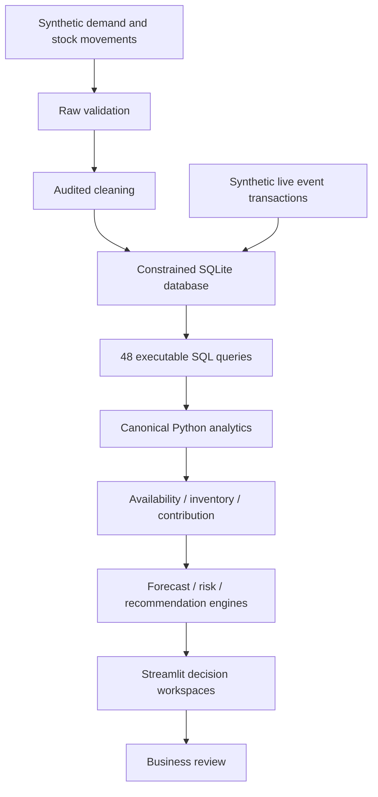

# SwiftCart · Quick-Commerce Availability & Profitability Control Tower

A runnable Business Analyst, Data Analyst and BI portfolio project connecting demand, inventory, fulfillment, delivery and contribution economics.

**Validation status:** the 300,000-order pipeline and automated application checks have executed. Browser visual validation and actual browser download checks remain blocked by the available browser policy check. No screenshots or validated Power BI report file are claimed. See [validation evidence](reports/VALIDATION.md).

All data in this project is synthetic and simulated for educational and portfolio purposes.

All monetary values in this project are represented in Indian Rupees (INR).

This project operates in a simulated Indian quick-commerce business context using synthetic data.

## Business problem and decisions
Leadership needs to know where service is failing, which stock positions require intervention, and whether sales translate into contribution. Operations, supply chain, stores, category, commercial, marketing, finance and customer experience have different decision needs. SwiftCart connects those needs through documented requirements, 32 user stories, process maps, KPI definitions and evidence-based action suggestions.

The application answers: Where is demand unfulfilled? Which stores have coverage deficits? Which products tie up stock? What erodes contribution? Which intervention deserves review first? Financial exposure and scenario improvements are estimates, never realized business savings.

## Quick start
Use Python 3.12 and a terminal opened in this repository. Allow sufficient disk space for Python dependencies and generated data.

```powershell
python -m venv .venv
.\.venv\Scripts\Activate.ps1
python -m pip install -r requirements.txt
python run_pipeline.py
python -m pytest tests -q
streamlit run app.py
```

Open [the local application](http://127.0.0.1:8501) in Chrome or another browser. The generation step is separate from app runtime. On platforms other than Windows, activate the virtual environment using the platform equivalent.

For a small smoke dataset in PowerShell:

```powershell
Set-Item Env:DATASET_SIZE 100
python run_pipeline.py
Remove-Item Env:DATASET_SIZE
```

Run the pipeline again without the override to restore the default 300,000 orders. Environment overrides are read directly; `.env.example` documents them but is not automatically loaded. `SWIFTCART_DATA_DIR` optionally relocates raw Parquet, clean Parquet and SQLite data. Otherwise they live in `data/` inside the project. No source edits are required.

## Architecture


## Model and dataset
The default run covers 120 days, four Indian cities, eight stores, forty products, four categories and three promotion states. There are sixteen required relational tables: five facts and eleven dimensions. Orders, order lines, daily store/SKU stock, delivery and promotion exposure have separate grains. Foreign keys are enforced. [Data dictionary](docs/DATA_DICTIONARY.md) lists actual columns, keys and relationships.

Daily demand varies by weekends, time, store, product velocity and promotion exposure. Inventory is not independently random: opening stock plus receipts minus fulfilled units and modeled wastage equals closing stock. Accepted substitutions consume replacement inventory. Controlled defects are injected and reported before repair.

## Analytics and assumptions
- **Availability:** opening sellable inventory observations differ from unit fill rate. Lost revenue values unmet requested units after discount and is labeled ESTIMATED.
- **Inventory:** trailing demand, lead time and safety stock determine coverage and reorder suggestions. Confirm open inbound supply before acting; recommendations do not subtract purchase orders.
- **Profitability:** recognized gross sales minus discount, COGS and allocated variable operating costs gives contribution before inventory write-offs. This excludes fixed-cost accounting.
- **Promotions:** exposed versus unexposed differences are descriptive and noncausal. Incremental revenue, profit and ROI are explicitly proxies.
- **Forecasting:** four explainable methods; chronological training, validation and final fourteen-day test. Selection uses validation MAE. MAE, RMSE, WAPE and signed bias are reported. Future bands are approximate.
- **Risk:** a transparent lead-time stock deficit score, not a calibrated probability. Actions contain evidence, exposure, owner and timing.
- **Scenarios:** fixed-mix modeled estimates with demand, fulfillment, availability, discount, AOV/price, delivery cost and lead-time controls.
- **Customers:** observed frequency, segment behavior and contribution. Observed period value is not claimed as lifetime value.

Read the [methodology](docs/METHODOLOGY.md), [KPI dictionary](docs/KPI_DICTIONARY.md), [lineage](docs/DATA_LINEAGE.md) and [business rules](docs/BUSINESS_RULES.md) before interpreting outputs. Empty headline denominators return zero by convention; days of inventory is undefined for zero demand.

## Dashboard
Fourteen workspaces: Control Tower, Availability, Inventory, Profitability, Store Operations, Demand, Delivery, Promotions, Opportunities, Scenario Lab, Action Center, Data Explorer, Forecasting and Methodology. The home workspace starts with computed interventions. Expand Scope to drill City → Store → Category → Product/SKU and select dates. Financial tables use a single Indian Rupee formatter. CSVs keep numeric INR columns. Browser downloads are capped at 10,000 rows; full extracts are available in SQLite/Parquet.

**LIVE SIMULATION — SYNTHETIC DATA:** a separate database receives newly generated order lifecycles and explicit event rows. Start, pause, speed, advance and reset are functional. Stock changes in transactions, duplicate batches are idempotent, and the same KPI layer recalculates values. This is accelerated completed-order simulation, not production data or concurrent dispatch. Historical data is preserved on reset.

## SQL and Python
The six query collections answer 48 business questions using joins, CTEs, conditional aggregation, window ranks, rolling means, date calculations, cohort analysis and a nearest-rank percentile example. The canonical SQLite view allocates order costs to lines. Python independently derives the same financial values; reconciliation uses an absolute INR 0.01 tolerance. P90 in canonical Python uses linear interpolation, while the illustrative SQL nearest-rank result is a documented variant.

`python run_pipeline.py` generates and validates raw data, cleans it, stores Parquet and SQLite, executes every SQL query, computes KPIs, runs demand/inventory/profitability analyses, evaluates forecasts, generates risk/action reports and validates baseline scenarios. It fails on invalid relationships or unreconciled totals.

## Evidence and deliverables
- [Executed results](reports/RESULTS.md), [quality audit](reports/data_quality_report.csv), [business insights](reports/business_insights.md)
- [Requirements](docs/BUSINESS_REQUIREMENTS.md), [user stories](docs/USER_STORIES.md), [as-is](docs/AS_IS_PROCESS.md), [to-be](docs/TO_BE_PROCESS.md)
- [72 interview questions](docs/INTERVIEW_GUIDE.md), [two-minute explanation](docs/TWO_MINUTE_EXPLANATION.md), [resume bullets](docs/RESUME_BULLETS.md)
- [Honest hiring-manager review](PROJECT_STRENGTH_REVIEW.md)
- [Power BI implementation guide](powerbi/POWERBI_GUIDE.md): proposed model and DAX; no report file or executed Power BI claim
- Six notebooks contain executed code/output and reuse actual pipeline reports. Run the pipeline first, then execute them in a Python notebook environment.

## Repository layout
```text
app.py                         Streamlit application
run_pipeline.py                Reproducible pipeline
config/config.yaml             Default generation / inventory settings
src/                           Generation, validation and analytical engines
database/                      Schema, storage and canonical SQL views
sql/                           Six collections, 48 business questions
data/raw/                      Generated dirty Parquet, ignored by Git
data/processed/                Generated clean data and databases, ignored by Git
data/sample/                   Small illustrative records, not a complete FK subset
reports/                       Actual metrics and execution evidence
notebooks/                     Six executed analytical notebooks
docs/                          BA artifacts, methodology and interview material
powerbi/                       BI implementation guide
tests/                         Behavioral, adversarial and app tests
screenshots/                   Validation-status note; no fabricated screenshots
```

## Testing and performance
Use `python -m pytest tests -q`. Tests cover corruption rejection, zero orders/revenue/stock, high demand, financial allocation, forecast leakage, live idempotency, reset, page navigation, filters, scenario changes and forecast controls. Streamlit AppTest validates programmatic behavior; it does not replace browser visual inspection. Tests use isolated databases and do not regenerate the historical dataset.

Data is generated once, SQL has indexes, large group operations are vectorized, and app datasets are cached by database modification time. See `reports/application_validation.json` for measured cold and warm page times and `reports/run_summary.json` for pipeline duration. Data Explorer exports are capped to avoid repeatedly serializing the whole dataset.

## Limitations and next steps
This is a synthetic educational simulation. Data quality corruption is intentionally small and controlled. Expiry uses a stock-age proxy; inbound purchase orders, batch-level expiry, customer-initiated cancellations, returns, fixed costs and taxes are absent. Promotion inference is noncausal. Customers repeat, limiting the simple statistical independence assumption. Forecast bands are approximate, horizons are short and hierarchical forecasts are not reconciled. Live mode omits substitution and expiry and assumes a local single-user demonstration. Observed customer value is not a retention-based lifetime model.

Browser visual checks and real browser download verification remain pending because the automation policy check blocked access. Complete the manual checklist before calling the full original quality gate complete. Improvements should prioritize those checks, inbound and expiry fidelity, clustered statistical inference and richer forecasting evaluation.

## GitHub hygiene
Generated raw/processed data, environments, cache files and secrets are ignored. The source archive excludes them. Regenerate data with the pipeline after cloning. No credentials, real customer records or machine-specific source paths are required. Screenshots should only be added after visually validating the actual app.
