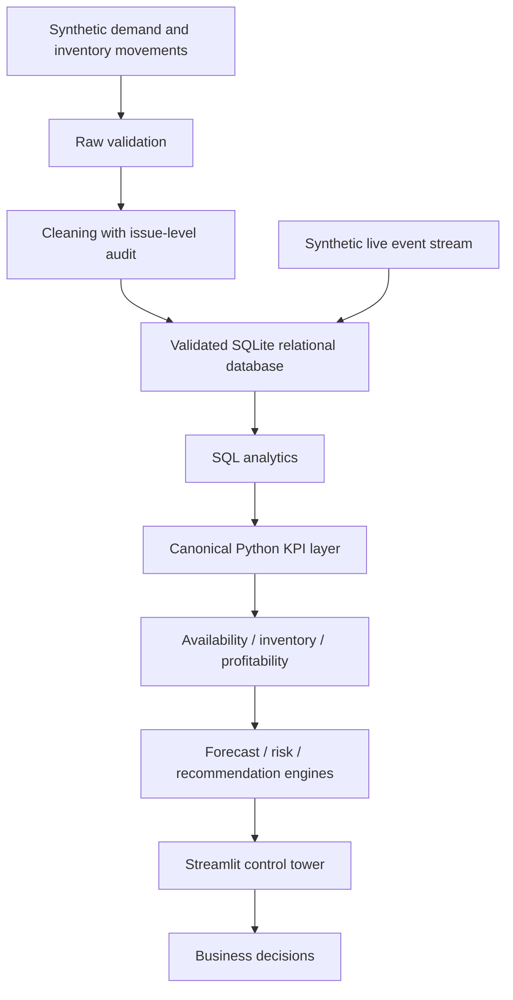

# Architecture and implementation contract

SwiftCart is a synthetic portfolio simulation in an Indian quick-commerce market.
All monetary values in this project are represented in Indian Rupees (INR).
All data in this project is synthetic and simulated for educational and portfolio purposes.

## Design decisions

- SQLite provides portable storage, transactions, foreign keys and executable SQL without a separate server.
- Pandas and NumPy calculate shared analytics. Streamlit consumes those calculations.
- Monetary fields are numeric INR; presentation uses `src.utils.format_inr`.
- Order facts have one row per order. Item facts have one row per order line. Inventory snapshots have one row per date/store/product. Order-level costs must be allocated once before product aggregation, avoiding join fan-out.
- Availability is the share of eligible inventory observations with sellable opening stock. Fill rate is fulfilled requested units divided by requested units. They are distinct metrics.
- Substitution is recorded separately from original-SKU fulfillment and must consume replacement inventory. Unfulfilled units exclude accepted substitutes.
- Gross sales recognize fulfilled goods. Net sales subtract recognized discounts. Contribution subtracts COGS and all modeled variable costs once.
- Lost revenue is an estimate from unfulfilled requested units and expected realized selling price; it is never recorded as actual revenue.
- Forecast evaluation uses chronological holdout. Model selection and interval calibration cannot use the final test period.
- Live simulation must persist idempotent events in transactions; reset affects only simulation state.
- Generated large data may be relocated through SWIFTCART_DATA_DIR. No machine-specific path belongs in source.

## Phase gates

Each phase must run and validate before dependent implementation proceeds. Execution evidence belongs in reports/BUILD_STATUS.md. File presence alone is not a passing gate.

1. Architecture and configuration
2. Synthetic generation
3. Validation and cleaning
4. Database schema and loading
5. SQL analytics
6. Python analytics
7. Forecasting
8. Risks and recommendations
9. Business documentation
10. Streamlit application
11. Automated tests
12. Integration tests
13. Performance
14. UI checks
15. End-to-end validation
16. GitHub readiness
