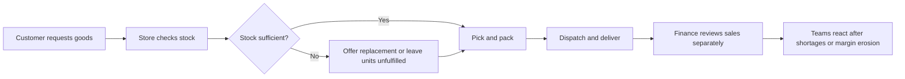

# As-is process

Pain points: disconnected unit and financial measures; stale stock coverage; comparison of store totals without workload context; promotion revenue reviewed without variable cost. These are fictional requirements, not claims about an actual company.
