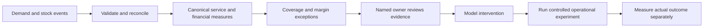

# To-be process

The application ends at decision support. It does not place orders, send alerts to employees, or claim implemented commercial improvements. Live events demonstrate ingestion and monitoring only.
